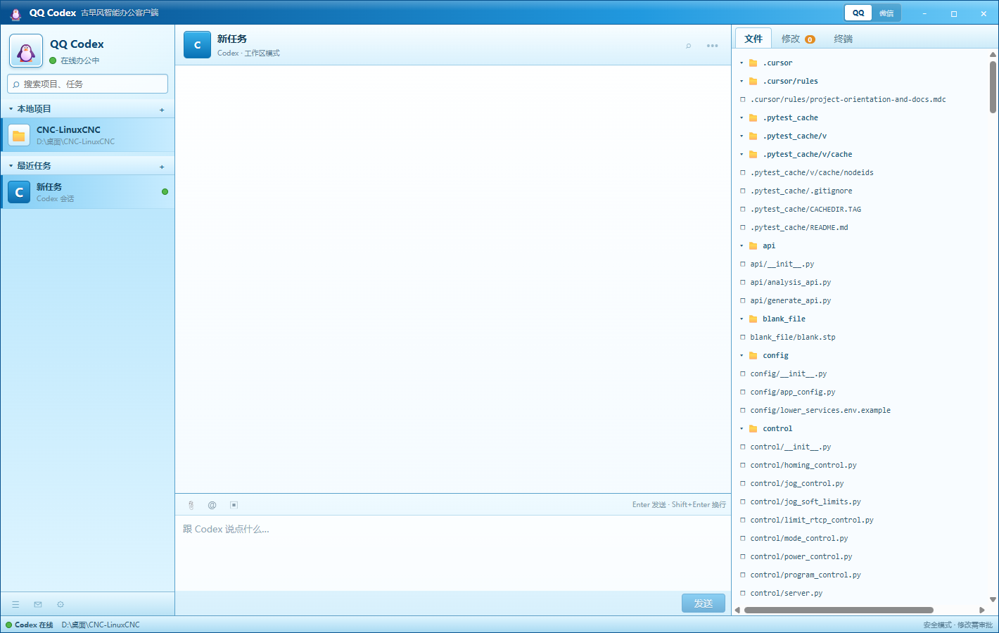

# QQ Codex

一个采用 QQ 2009 经典蓝色视觉语言的 Windows Codex 桌面客户端。它不是静态界面演示，底层直接启动官方 `@openai/codex` 包提供的 Codex App Server。



## 当前功能

- 选择并保存本地项目
- 创建、恢复、搜索和重命名 Codex 任务
- 发送消息并查看流式回复
- 停止正在执行的回合
- 显示命令输出和本回合 Diff
- 显示并处理命令、文件修改审批
- 浏览项目文件树
- 保存最近工作区和任务索引
- QQ 2009 风格三栏窗口、聊天气泡和状态栏

## 运行

需要 Windows 与 Node.js 18 或更高版本。

```powershell
npm install
npm run dev
```

首次创建任务时，客户端使用当前 Codex 配置目录中的登录状态。若尚未登录，请先通过官方 Codex CLI 或官方 Codex 客户端完成登录。

## 构建与打包

```powershell
npm run build
npm run package
```

生成结果位于 `release/`。`win-unpacked/QQ Codex.exe` 可以直接运行，NSIS 文件是安装程序。

## 验证

```powershell
npm run typecheck
npm test -- --run
$env:RUN_REAL_CODEX='1'; npm test -- --run tests/integration/RealCodexWorkflow.test.ts
```

最后一条命令会调用真实 Codex 服务，创建一个只回复固定短句、不运行工具的测试回合。

## 安全设计

渲染进程启用上下文隔离、沙盒，并关闭 Node 集成。文件系统、工作区、任务和审批只通过白名单 IPC 进入 Electron 主进程。任务默认使用 `workspace-write` 沙盒和 `on-request` 审批策略。

## 首版边界

首版没有实现自动化、语音、浏览器控制、应用连接器、插件市场和官方客户端全部设置。聊天工具栏中尚未实现的入口会显示为禁用状态，不会伪装成可用功能。
